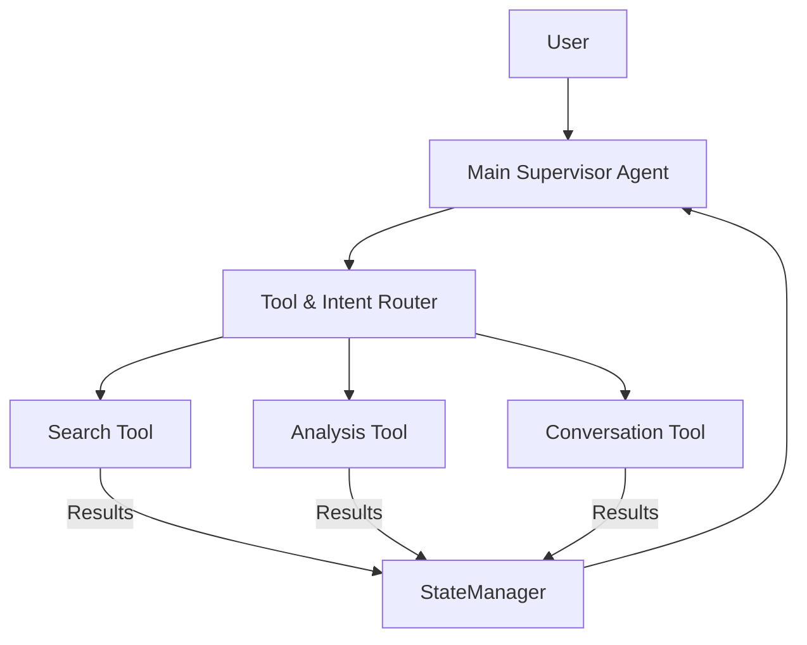

# Talk2Agents

**Talk2Agents** is a hierarchical multi-agent system designed to perform complex tasks through the collaboration of multiple AI agents. It integrates state management, tool invocation, and seamless orchestration to enable AI-driven research, document analysis, and intelligent interaction.

---

## Features

- **Main Supervisor Agent**: Orchestrates tasks by delegating them to specialized sub-agents.
- **Sub-Agents**:
  - `Agent_S2`: Semantic Scholar integration for academic paper search.
  - `Agent_Zotero`: Bibliography management.
  - `Agent_PDF`: Document analysis.
  - `Agent_Arxiv`: PDF retrieval.
- **LangGraph Integration**: Efficient state management and tool routing for seamless interaction.
- **Streamlit UI**: User-friendly interface for interacting with the system.
- **Dockerized Setup**: Simplified deployment with isolated services.

---

## Architecture

### 1. Hierarchical Agent System

The system employs a top-down structure with a main agent supervising multiple sub-agents, each specializing in a unique domain.



### 2. Agent Communication Workflow

1. **User Query** → **Main Agent** → **Sub-Agent** → **State Update** → **Response** → **UI**
2. **Example**:
   - **User**: "Find papers about LLMs"
     - Main Agent routes task to `Agent_S2`.
     - `Agent_S2` fetches results via Semantic Scholar API.
     - State stores search results.
     - UI displays a table of papers.

---

## Development Phases

### Phase 1: Basic Setup

- Implement the Main Agent.
- Set up `Agent_S2`.
- Basic state management.
- Simple UI.

### Phase 2: Search Implementation

- API integration.
- Result processing.
- State storage.
- Table display.

### Phase 3: Context Management

- Row selection.
- Paper details retrieval.
- Conversation memory.

---

## Installation

### Prerequisites

- Python 3.8+
- Docker
- Streamlit

### Steps

1. Clone the repository:
   ```bash
   git clone https://github.com/ansh-info/Talk2Agents.git
   cd Talk2Agents
   ```
2. Install dependencies:
   ```bash
   pip install -r requirements.txt
   ```
3. Build and run the Docker containers:
   ```bash
   docker-compose up --build
   ```
4. Run the Streamlit UI:
   ```bash
   streamlit run app.py
   ```
5. Access the application in your browser at `http://localhost:8501`.

---

## Usage

1. Enter your query in the Streamlit interface.
2. The Main Agent analyzes the request and routes tasks to the appropriate sub-agent.
3. Results are stored in the system state and displayed on the UI.
4. Perform further actions such as selecting rows, retrieving details, or running analyses.

---

## Examples

### Example 1: Searching for Papers

- **Input**: "Find papers about LLMs."
- **Output**: A table displaying search results from Semantic Scholar.

### Example 2: Retrieving Paper Details

- **Input**: "Tell me about row 4."
- **Output**: Detailed information about the selected paper.

---

## Technologies Used

- **LangGraph**: For state management and agent orchestration.
- **Semantic Scholar API**: For academic paper search.
- **Streamlit**: Interactive user interface.
- **Docker**: Containerized deployment.
- **Python**: Core programming language.

---

## Roadmap

- [ ] Add more sub-agents (e.g., citation analysis, keyword extraction).
- [ ] Expand UI capabilities.
- [ ] Integrate with additional APIs (e.g., PubMed, IEEE Xplore).
- [ ] Enhance context management for multi-turn conversations.

---

## Contributing

We welcome contributions! To get started:

1. Fork the repository.
2. Create a new branch:
   ```bash
   git checkout -b feature-name
   ```
3. Commit your changes:
   ```bash
   git commit -m "Add feature"
   ```
4. Push to your fork and submit a pull request.

---

## License

This project is licensed under the MIT License. See the [LICENSE](LICENSE) file for details.

---

## Contact

For questions or collaboration, reach out to [Ansh Kumar](mailto:anshkumar.info@gmail.com).

---

## Acknowledgments

- [LangGraph Documentation](https://langchain-ai.github.io/langgraph/)
- [Semantic Scholar API](https://www.semanticscholar.org/product/api)
- [Streamlit](https://streamlit.io/)
- [AutoGen Paper](https://arxiv.org/abs/2308.08155)
