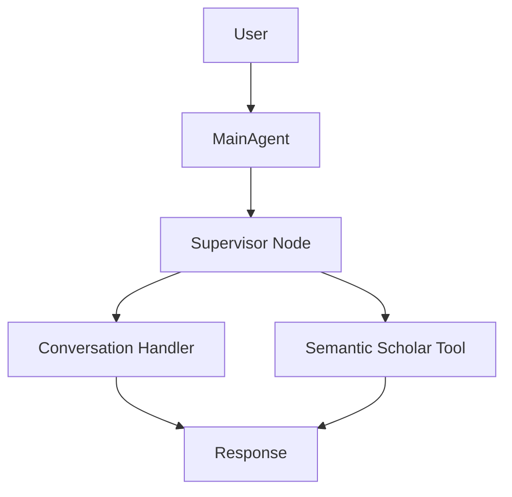

Here's a comprehensive overview of what we're building:

**Project: Talk2Papers - Academic Research Assistant**
A hierarchical agent system using LangGraph for managing academic paper searches and interactions.

**Core Components:**

1. MainAgent: Orchestrates workflow and handles user interactions
2. SemanticScholarClient: Manages academic paper searches
3. WorkflowManager: Handles state and routing
4. EnhancedWorkflowManager: Improved version with better routing

**Current Architecture:**



**What We've Achieved:**

1. ✅ Basic LangGraph integration
2. ✅ Semantic Scholar API integration with rate limiting
3. ✅ Message type handling fixes
4. ✅ Basic conversation vs. search routing
5. ✅ Error handling for API calls
6. ✅ State management structure

**Current Issues Being Addressed:**

1. 🔧 Tool invocation for greetings (needs fixing)
2. 🔧 Response handling in conversation flow
3. 🔧 Message state management
4. 🔧 Proper routing between nodes

**Still To Do:**

1. Implement paper analysis capabilities
2. Add conversation memory/context
3. Improve search result formatting
4. Add paper comparison features
5. Implement citation analysis
6. Add proper conversation thread handling
7. Implement better rate limiting with API key
8. Add proper error recovery
9. Improve debug logging
10. Add proper testing

**Key Files:**

```bash
agent/
├── enhanced_workflow.py  # Enhanced workflow manager
├── main_agent.py        # Main agent orchestration
├── workflow_graph.py    # Graph structure
└── workflow_manager.py  # Basic workflow management

clients/
├── ollama_client.py     # LLM client
└── semantic_scholar_client.py  # API client

state/
└── agent_state.py       # State management

tools/
├── semantic_scholar_tool.py  # Search tool
└── state_tool.py            # State management tool
```

**Current Focus:**

- Fixing the routing issue where the semantic scholar tool is being called unnecessarily for greetings
- Improving response handling to show proper user responses
- Ensuring proper message state management throughout the workflow

**Technical Details:**

- Using Ollama's local LLM (llama3.2:1b-instruct-q3_K_M)
- Semantic Scholar API for paper searches
- LangGraph for workflow management
- Pydantic for data modeling
- Async/await patterns throughout

**Next Immediate Tasks:**

1. Verify the routing fixes work correctly
2. Implement proper conversation memory
3. Add search result formatting
4. Implement proper API key handling
5. Add conversation context tracking

This project aims to create a hierarchical agent system that can intelligently handle academic paper searches and discussions, maintaining context and providing meaningful interactions.
