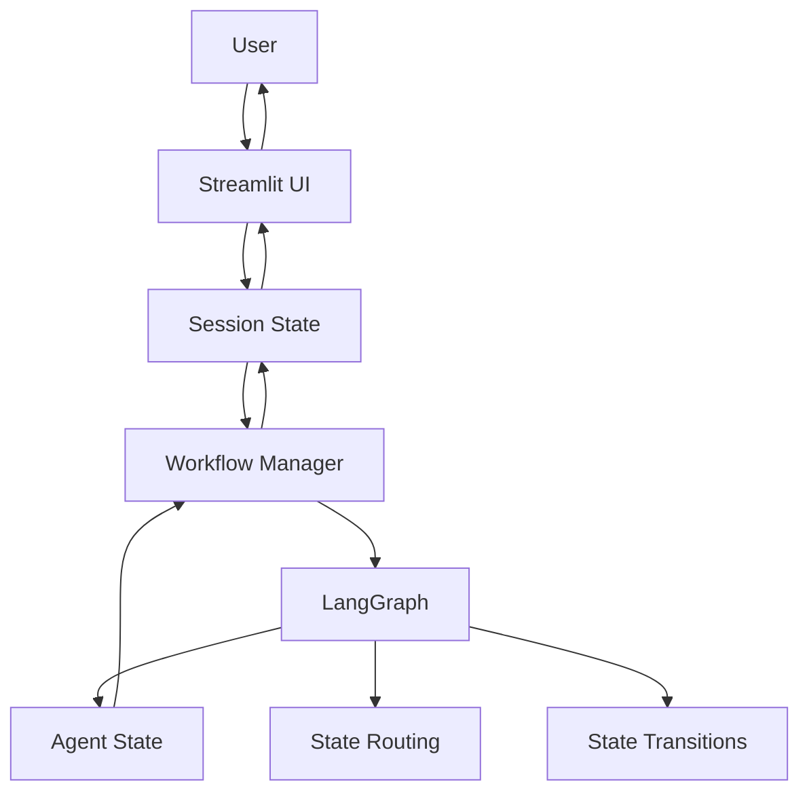

Architectural question! Let me clarify the roles and responsibilities:

1. **LangGraph's Role**:

- LangGraph is meant to handle the flow/routing of conversational states and transitions
- It manages the conversation logic and decision-making process
- It maintains the state during a single conversation flow
- It doesn't handle persistence between web sessions

2. **Why We Still Need Session State**:

- Web applications are stateless by nature
- Each Streamlit refresh/request is essentially a new session
- LangGraph's state is in-memory and doesn't persist across HTTP requests

Here's a diagram of how it should work:



Best Practices:

1. **LangGraph Should Handle**:

```python
# In workflow_graph.py
class WorkflowGraph:
    def setup_graph(self):
        # Handle conversation flow
        self.graph.add_node("start", self._start_node)
        self.graph.add_node("route", self._route_message)
        # Handle state transitions
        self.graph.add_edge("start", "route")
```

2. **Session State Should Handle**:

```python
# In dashboard.py
class DashboardApp:
    def __init__(self):
        # Handle web session persistence
        if "workflow_manager" not in st.session_state:
            st.session_state.workflow_manager = EnhancedWorkflowManager()
```

3. **Workflow Manager Should Bridge**:

```python
# In enhanced_workflow.py
class EnhancedWorkflowManager:
    async def process_command_async(self, command: str) -> AgentState:
        # Bridge between session and LangGraph
        processed_state = self.workflow_graph.process_state(self.current_state)
        return processed_state
```

Questions:

1. **Why use Streamlit session?**

   - Because web applications need persistence between requests
   - LangGraph doesn't handle web session management

2. **Is this required?**

   - Yes, for a web application
   - No, if this were a CLI or single-process application

3. **Should LangGraph handle everything?**
   - LangGraph should handle conversation flow and state transitions
   - But not web session management or UI state

The ideal architecture is:

- LangGraph: Conversation flow, state transitions
- Streamlit Session: Web persistence, UI state
- Workflow Manager: Bridge between the two

This separation of concerns allows:

- Clean architecture
- Clear responsibilities
- Proper state management
- Scalable application
